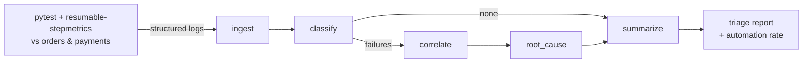

# Agentic Log Triage

> Deterministic multi-agent (**LangGraph** + **MCP**) triage over **high-volume
> structured** pytest step-logs — packaged to run as a **Kubernetes Job**.

A runnable reference implementation of the pattern:

> *Designed and shipped a production-grade Agentic AI platform using LangGraph and MCP,
> including deterministic multi-agent workflows over high-volume structured logs;
> reduced operational triage effort by 50%.*

📖 **Docs:** https://karthikb35.github.io/agentic-log-triage/ · rendered from
[`docs/`](docs/) with MkDocs Material and published to GitHub Pages.

## What it does



1. A `pytest` suite instrumented with
   [`pytest-resumable-stepmetrics`](https://pypi.org/project/pytest-resumable-stepmetrics/)
   exercises two mock TicketHub services and emits **structured JSON step-logs**.
2. A **LangGraph** state machine of four small **deterministic** agents ingests the
   logs, **classifies** each failure, **correlates** duplicates into incidents,
   attaches a probable cause + runbook via an **MCP tool**, and reports a
   **triage automation rate**.
3. It ships as a **CronJob/Job** with production-grade defaults.

## Quickstart

```bash
python -m venv .venv && . .venv/bin/activate        # Windows: .venv\Scripts\activate
pip install -e . pytest pytest-resumable-stepmetrics

# Triage the bundled sample logs (no test run needed)
triage run --reports examples/sample_steplogs --format md

# ...or generate fresh logs then triage, gating on 50% automation
pytest --steplog-json --steplog-json-dir=reports
triage run --reports reports --format md --fail-under 0.5
```

## Layout

```text
src/triage/          the engine
  ingest.py          load step-logs, extract failures
  graph.py           LangGraph StateGraph (+ deterministic fallback)
  agents/            classify · correlate · root_cause · summarize
  mcp/               typed MCP tools (+ optional server)
  llm.py             optional LLM narrator (behind TRIAGE_LLM=1)
  cli.py             `triage run`
services/            mock orders + payments (systems under test)
tests/               pytest suite that emits the structured step-logs
examples/            canned step-logs covering the full taxonomy
deploy/              Dockerfile + Job + CronJob (kustomize)
docs/                MkDocs Material site
```

## Why deterministic?

Fixed graph topology + pure-function agents + pure-lookup tools ⇒ **the same logs
always produce the same triage**. An LLM can optionally *narrate* the result but
never *decides* anything — which is what makes it safe to put in a CI gate. See
[docs/philosophy.md](docs/philosophy.md).

## Kubernetes Jobs — and when not to

Triage is batch work with a clear "done", so it maps cleanly onto a **Job/CronJob**.
For real-time triage, graduate to a **KEDA-scaled Deployment**; for complex DAGs,
wrap Jobs in **Argo Workflows**. Details and manifests in
[docs/kubernetes-jobs.md](docs/kubernetes-jobs.md).

## License

MIT — see [LICENSE](LICENSE).
