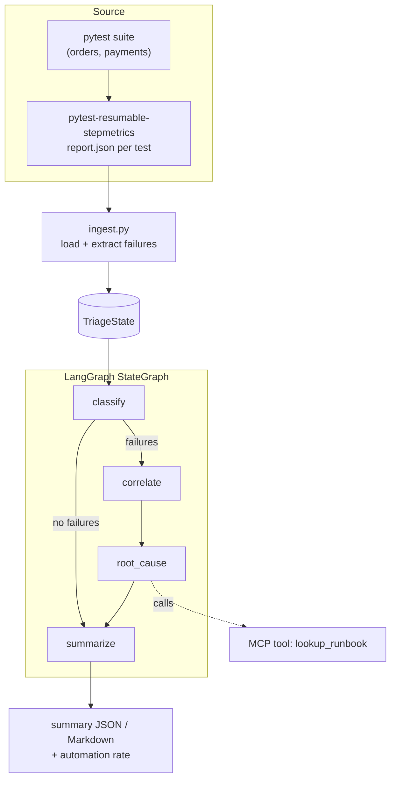

# Architecture

## The pipeline



## State: one serialisable object

Every node reads and returns a slice of `TriageState`:

```python
class TriageState(TypedDict, total=False):
    reports:   list[dict]        # raw step-logs
    failures:  list[Failure]     # extracted failing steps
    incidents: list[Incident]    # correlated groups
    summary:   dict              # metrics + narrative
```

Because state is plain data, any run can be **snapshotted, replayed, or diffed**.

## Ingest — from logs to failures

`ingest.py` loads every JSON report under a directory and extracts only steps with
`status == "failed"`. Two details make correlation work:

- **`skipped_on_retry` is not a failure.** It means the step passed on an earlier
  attempt and was skipped by the framework — so it is ignored.
- **Signatures strip volatile tokens.** Numbers, UUIDs and hex ids are collapsed to
  `#`, so the same bug across 200 tests shares one signature and collapses to one
  incident.

## The graph — fixed topology, conditional short-circuit

`classify → (failures?) → correlate → root_cause → summarize`. If there are no
failures, the graph routes straight to `summarize` (a green report). The graph is
built with LangGraph's `StateGraph`; if LangGraph is unavailable the identical
nodes run sequentially via a fallback, so the demo never hard-depends on it.

## Output and the CI gate

`summarize` computes the **automation rate** and an estimated minutes-saved figure,
then the CLI renders JSON or Markdown. `--fail-under 0.5` makes the process exit
non-zero if automation coverage drops — turning triage quality into a build signal.
