# Deep Dive: How It All Works

!!! abstract "Who this page is for"
    A new engineer who has never seen this system (or maybe never used Redis,
    Kubernetes, or a message queue). We build every idea up from first principles,
    with a diagram for almost everything. Read it top to bottom; nothing later
    depends on knowledge you don't have yet.

---

## 0. The one-paragraph summary

When a test suite runs in CI, it produces thousands of structured log records.
Reading those by hand to find *"what actually broke and why"* is slow, boring, and
error-prone. This system does it automatically: a small set of **deterministic
agents** classify failures, group them into a few real **incidents**, attach a
**probable cause + runbook**, and report an **automation rate**. You can run it as
a batch job, or call it live over an **HTTP API** that scales itself.

---

## 1. Vocabulary (read this first)

| Term | Plain-English meaning |
| --- | --- |
| **Step-log** | A machine-readable record of one test's steps, attempts, and errors. |
| **Failure** | One failed step pulled out of a step-log. |
| **Signature** | A failure's error text with volatile bits (numbers, IDs) stripped, so identical bugs collapse to one string. |
| **Incident** | Many failures that share `(service, category, signature)` — i.e. *one real problem*. |
| **Agent** | A pure function that takes state and returns updated state. No hidden magic. |
| **Pipeline / graph** | The fixed sequence of agents: classify → correlate → root_cause → summarize. |
| **Deterministic** | Same input ⇒ same output, every time. Makes runs replayable and testable. |
| **Queue** | A buffer that holds work until a worker is free to process it. |
| **Redis** | An in-memory data store we use as the queue *and* the result store. |
| **Consumer group** | A set of workers that share one queue, each message handled by exactly one worker. |
| **KEDA** | A Kubernetes add-on that adds/removes worker Pods based on how much work is waiting. |
| **Sentinel** | Redis's built-in failover manager: promotes a replica if the master dies. |
| **Idempotent** | Safe to do more than once; the second time has no extra effect. |

---

## 2. The mental model

Think of it like a **restaurant kitchen**:

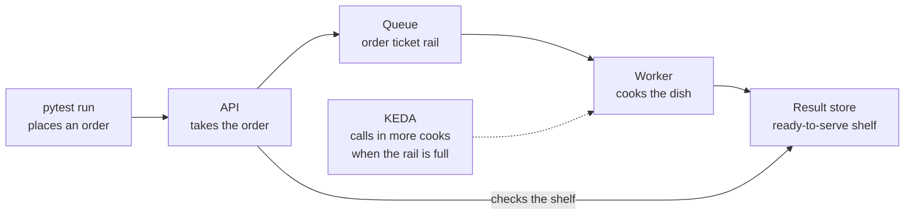
```mermaid
flowchart LR
    Customer[pytest run<br/>places an order] --> Waiter[API<br/>takes the order]
    Waiter --> Ticket[Queue<br/>order ticket rail]
    Ticket --> Cook[Worker<br/>cooks the dish]
    Cook --> Pass[Result store<br/>ready-to-serve shelf]
    Waiter -->|checks the shelf| Pass
    Manager[KEDA<br/>calls in more cooks<br/>when the rail is full] -.-> Cook
```

- The **waiter (API)** never cooks — they take orders fast and hand back a ticket
  number so the customer can come back later.
- The **rail (queue)** holds tickets until a cook is free.
- **Cooks (workers)** each grab one ticket, cook, and put the plate on the shelf.
- The **manager (KEDA)** watches the rail; if it's backing up, more cooks appear.

---

## 3. The triage brain: four agents

The actual analysis is done by four tiny functions. None of them call an AI model;
they are ordinary, testable code.

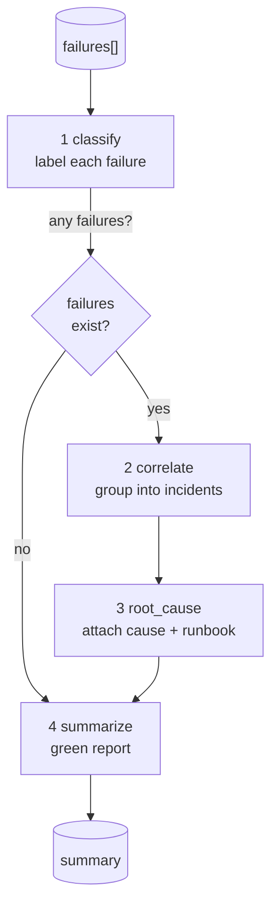
```mermaid
flowchart TD
    IN[("failures[]")] --> CL[1 classify<br/>label each failure]
    CL -->|any failures?| Q{failures<br/>exist?}
    Q -- no --> SU[4 summarize<br/>green report]
    Q -- yes --> CO[2 correlate<br/>group into incidents]
    CO --> RC[3 root_cause<br/>attach cause + runbook]
    RC --> SU
    SU --> OUT[("summary")]
```

1. **classify** — matches each error against ordered keyword rules and assigns a
   category (`timeout`, `dependency_unavailable`, `assertion`, `business_rule`,
   `infrastructure`, or `unknown`).
2. **correlate** — collapses many failures that share `(service, category,
   signature)` into a single incident. *One dead dependency = one incident, not 200
   tickets.*
3. **root_cause** — looks up a probable cause + runbook for the category (via the
   MCP `lookup_runbook` tool).
4. **summarize** — computes the headline **automation rate** and assembles the
   report.

!!! note "Why keyword rules instead of an LLM?"
    Rules are auditable and reproducible: you can point at the exact line that
    labeled a failure. Adding institutional knowledge = *adding a rule*, not
    retraining a model. An optional LLM can only *narrate* the finished summary; it
    never changes a number or a route.

### How correlation shrinks the noise

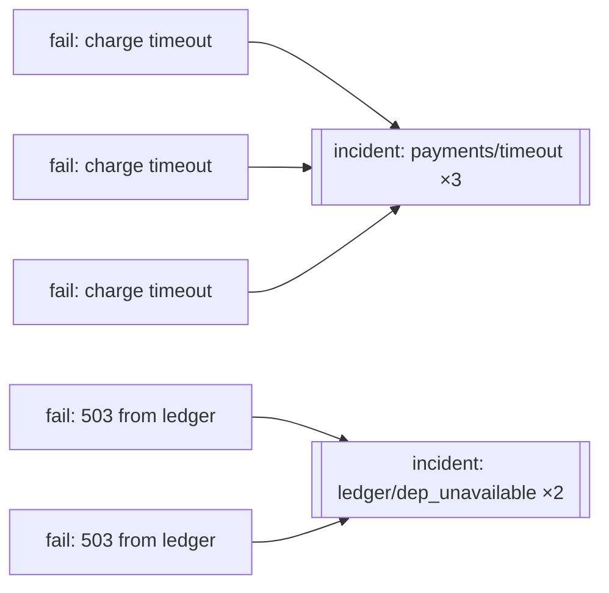
```mermaid
flowchart LR
    F1[fail: charge timeout] --> G1
    F2[fail: charge timeout] --> G1
    F3[fail: charge timeout] --> G1
    F4[fail: 503 from ledger] --> G2
    F5[fail: 503 from ledger] --> G2
    G1[[incident: payments/timeout ×3]]
    G2[[incident: ledger/dep_unavailable ×2]]
```

Five raw failures become **two** incidents — the thing a human actually acts on.

---

## 4. Two ways to run it

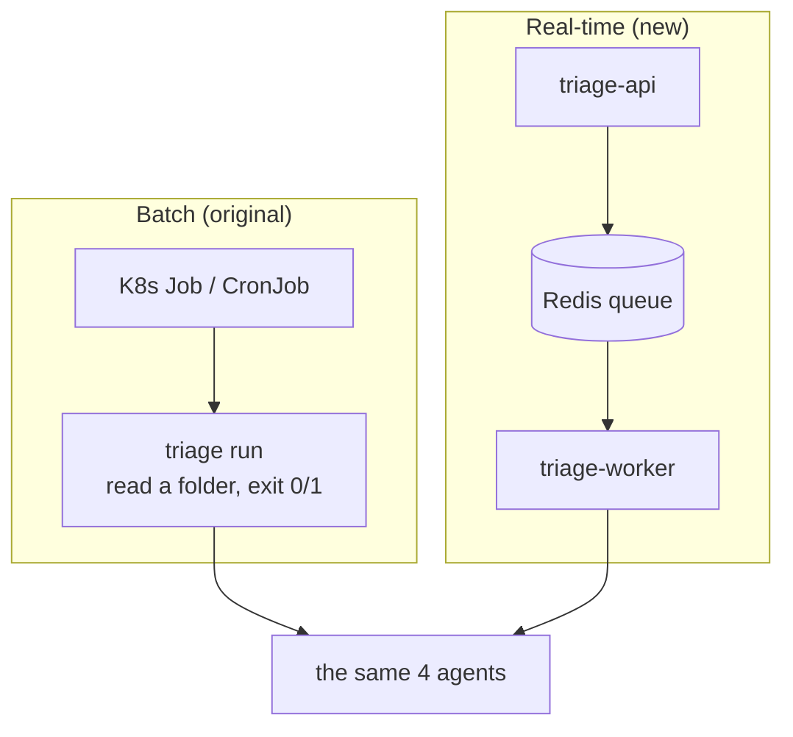
```mermaid
flowchart TB
    subgraph Batch["Batch (original)"]
      J[K8s Job / CronJob] --> RUN[triage run<br/>read a folder, exit 0/1]
    end
    subgraph Live["Real-time (new)"]
      API[triage-api] --> QUEUE[(Redis queue)] --> WK[triage-worker]
    end
    RUN --> PIPE[the same 4 agents]
    WK --> PIPE
```

Both paths run the **identical** pipeline. Batch is great for scheduled sweeps;
the live path gives a pytest run an immediate, per-run verdict.

---

## 5. The live path, step by step

Here is the complete journey of a single CI run, end to end:

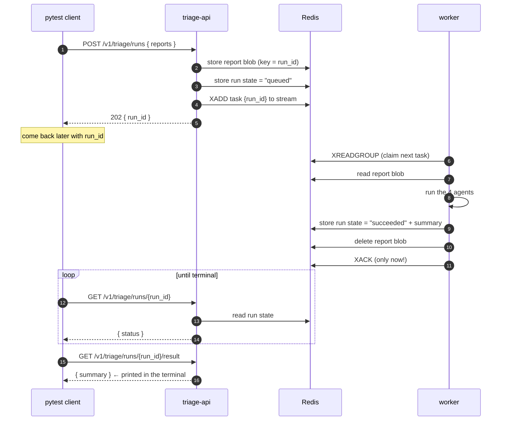
```mermaid
sequenceDiagram
    autonumber
    participant PT as pytest client
    participant API as triage-api
    participant R as Redis
    participant W as worker
    PT->>API: POST /v1/triage/runs { reports }
    API->>R: store report blob (key = run_id)
    API->>R: store run state = "queued"
    API->>R: XADD task {run_id} to stream
    API-->>PT: 202 { run_id }
    Note over PT: come back later with run_id
    W->>R: XREADGROUP (claim next task)
    W->>R: read report blob
    W->>W: run the 4 agents
    W->>R: store run state = "succeeded" + summary
    W->>R: delete report blob
    W->>R: XACK (only now!)
    loop until terminal
        PT->>API: GET /v1/triage/runs/{run_id}
        API->>R: read run state
        API-->>PT: { status }
    end
    PT->>API: GET /v1/triage/runs/{run_id}/result
    API-->>PT: { summary }  ← printed in the terminal
```

The key idea: **the API answers instantly** and the slow work happens later in a
worker. The client polls a UUID until the answer is ready. This is called an
**asynchronous request-reply** pattern.

---

## 6. Why a queue at all?

Without a queue, a traffic spike would either overload the workers or make the API
block. A queue **decouples** arrival rate from processing rate:

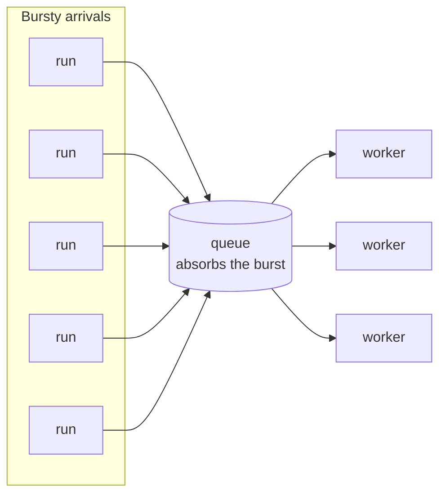
```mermaid
flowchart LR
    subgraph Bursty arrivals
      A1[run] & A2[run] & A3[run] & A4[run] & A5[run]
    end
    A1 & A2 & A3 & A4 & A5 --> Q[(queue<br/>absorbs the burst)]
    Q --> W1[worker]
    Q --> W2[worker]
    Q --> W3[worker]
```

The queue is a **shock absorber**. Arrivals can spike to 15/sec; the workers drain
the buffer at their own steady pace, and KEDA adds more workers if the buffer grows.

---

## 7. Redis Streams: the queue explained

A **Redis Stream** is an append-only log of messages. A **consumer group** lets
several workers share it so each message is processed once.

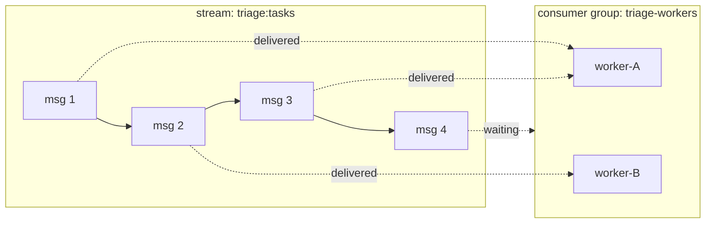
```mermaid
flowchart LR
    subgraph Stream["stream: triage:tasks"]
      m1[msg 1] --> m2[msg 2] --> m3[msg 3] --> m4[msg 4]
    end
    subgraph Group["consumer group: triage-workers"]
      w1[worker-A]
      w2[worker-B]
    end
    m1 -. delivered .-> w1
    m2 -. delivered .-> w2
    m3 -. delivered .-> w1
    m4 -. waiting .-> Group
```

When a worker reads a message, Redis moves it into that worker's **Pending Entries
List (PEL)** — "delivered but not yet confirmed." The worker must later send an
**`XACK`** to say "done, remove it." If it never acks (because it crashed), the
message can be **reclaimed** by another worker.

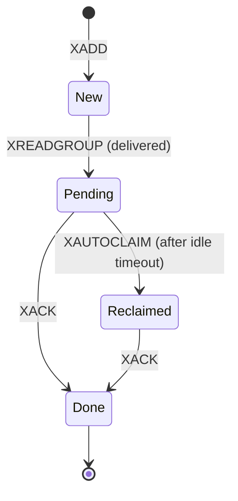
```mermaid
stateDiagram-v2
    [*] --> New: XADD
    New --> Pending: XREADGROUP (delivered)
    Pending --> Done: XACK
    Pending --> Reclaimed: XAUTOCLAIM (after idle timeout)
    Reclaimed --> Done: XACK
    Done --> [*]
```

---

## 8. "At-least-once" and the ack-last rule

We guarantee **at-least-once** processing: every task runs *at least* once, and may
occasionally run twice (e.g. a worker crashes right after finishing but before
acking). The golden rule that makes this safe:

> **Persist the result first. `XACK` last.**

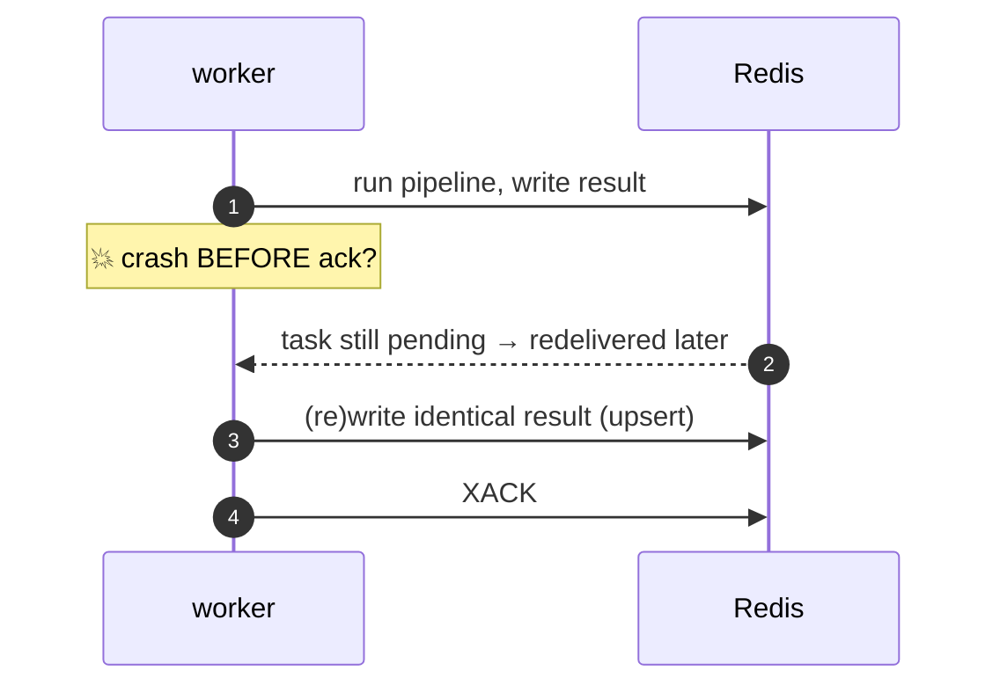
```mermaid
sequenceDiagram
    autonumber
    participant W as worker
    participant R as Redis
    W->>R: run pipeline, write result
    Note over W: 💥 crash BEFORE ack?
    R-->>W: task still pending → redelivered later
    W->>R: (re)write identical result (upsert)
    W->>R: XACK
```

Because the pipeline is **deterministic** and the store **upserts on `run_id`**,
running a task twice produces the exact same result — so a duplicate is harmless.
If we acked *before* persisting, a crash would lose the result forever. Order matters.

---

## 9. Idempotency: never do a thing twice by accident

Two different places need "do this at most once":

**a) Duplicate submissions.** If a flaky CI network makes pytest POST twice, an
`Idempotency-Key` header collapses both onto one run:

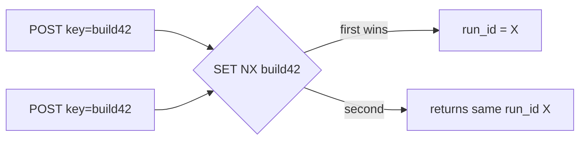
```mermaid
flowchart LR
    P1[POST key=build42] --> C{SET NX build42}
    P2[POST key=build42] --> C
    C -- first wins --> RUN[run_id = X]
    C -- second --> SAME[returns same run_id X]
```

**b) Duplicate ticket opening.** When a task is redelivered, we must not open a
second ticket for the same incident. A dedupe key `run_id + incident` is claimed
with `SET NX`:

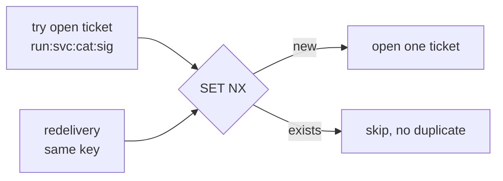
```mermaid
flowchart LR
    T1[try open ticket<br/>run:svc:cat:sig] --> K{SET NX}
    T2[redelivery<br/>same key] --> K
    K -- new --> OPEN[open one ticket]
    K -- exists --> SKIP[skip, no duplicate]
```

`SET NX` = "set only if not exists." It's an atomic *"claim this exactly once"*
primitive.

---

## 10. Autoscaling with KEDA

KEDA watches the queue's backlog and changes the number of worker Pods. Crucially,
it keeps a **warm floor** (never zero) because cold-starting a Pod on the first
request would be too slow here.

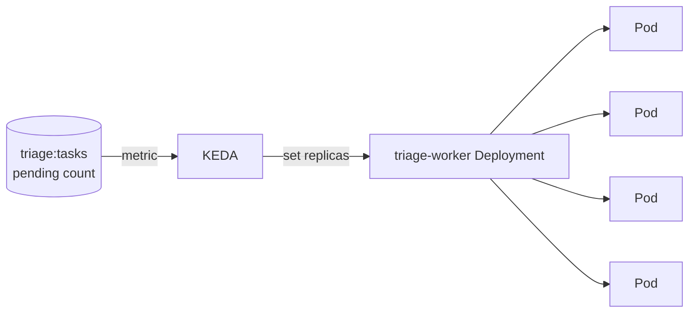
```mermaid
flowchart LR
    Q[(triage:tasks<br/>pending count)] -->|metric| KEDA
    KEDA -->|set replicas| D[triage-worker Deployment]
    D --> P1[Pod] & P2[Pod] & P3[Pod] & P4[Pod]
```

How replicas track load over a day:

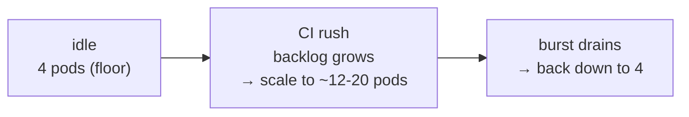
```mermaid
flowchart LR
    idle["idle<br/>4 pods (floor)"] --> rush["CI rush<br/>backlog grows<br/>→ scale to ~12-20 pods"]
    rush --> calm["burst drains<br/>→ back down to 4"]
```

- **Scale up** when pending-per-replica crosses a threshold (e.g. 30).
- **Scale down** back to the floor after a cool-down.
- The floor absorbs the *first* wave instantly; KEDA handles the *sustained* burst.

---

## 11. The data model (what lives in Redis)

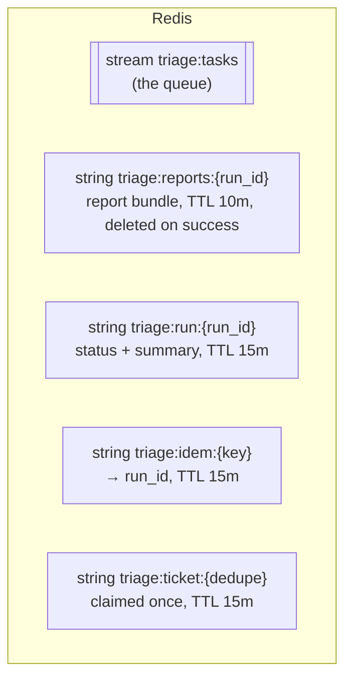
```mermaid
flowchart TB
    subgraph Redis
      S[["stream triage:tasks<br/>(the queue)"]]
      B["string triage:reports:{run_id}<br/>report bundle, TTL 10m, deleted on success"]
      RUN["string triage:run:{run_id}<br/>status + summary, TTL 15m"]
      IDEM["string triage:idem:{key}<br/>→ run_id, TTL 15m"]
      TIC["string triage:ticket:{dedupe}<br/>claimed once, TTL 15m"]
    end
```

Every key has a **TTL** (time to live), so the store cleans itself — there is no
background garbage collector to run. A run's state row moves through a simple
lifecycle:

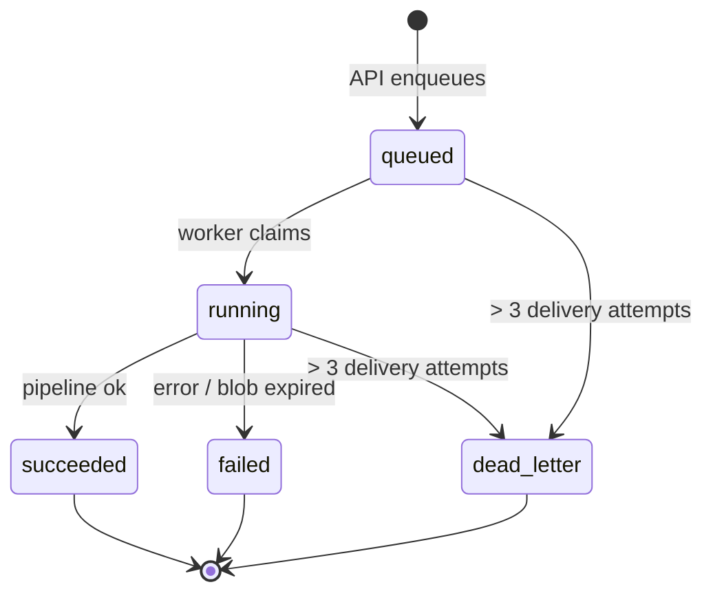
```mermaid
stateDiagram-v2
    [*] --> queued: API enqueues
    queued --> running: worker claims
    running --> succeeded: pipeline ok
    running --> failed: error / blob expired
    queued --> dead_letter: > 3 delivery attempts
    running --> dead_letter: > 3 delivery attempts
    succeeded --> [*]
    failed --> [*]
    dead_letter --> [*]
```

---

## 12. When things go wrong (failure catalogue)

| What fails | What happens | Why it's safe |
| --- | --- | --- |
| Worker crashes mid-run | Task stays pending; another worker `XAUTOCLAIM`s it after 60s | Deterministic + upsert ⇒ reprocessing is identical |
| A "poison" task keeps crashing | Parked as `dead_letter` after 3 tries | Client still reaches a terminal state |
| Report blob expired | Run marked `failed` ("payload missing"); task acked | No infinite redelivery loop |
| Redis backlog too big | API returns `429 Too Many Requests` | Clients retry; Redis is protected |
| Client stops polling | Keys expire by TTL | Store self-cleans |
| Single Redis restarts | In-flight runs lost; clients resubmit (or use HA) | Transient state; §HA removes this |

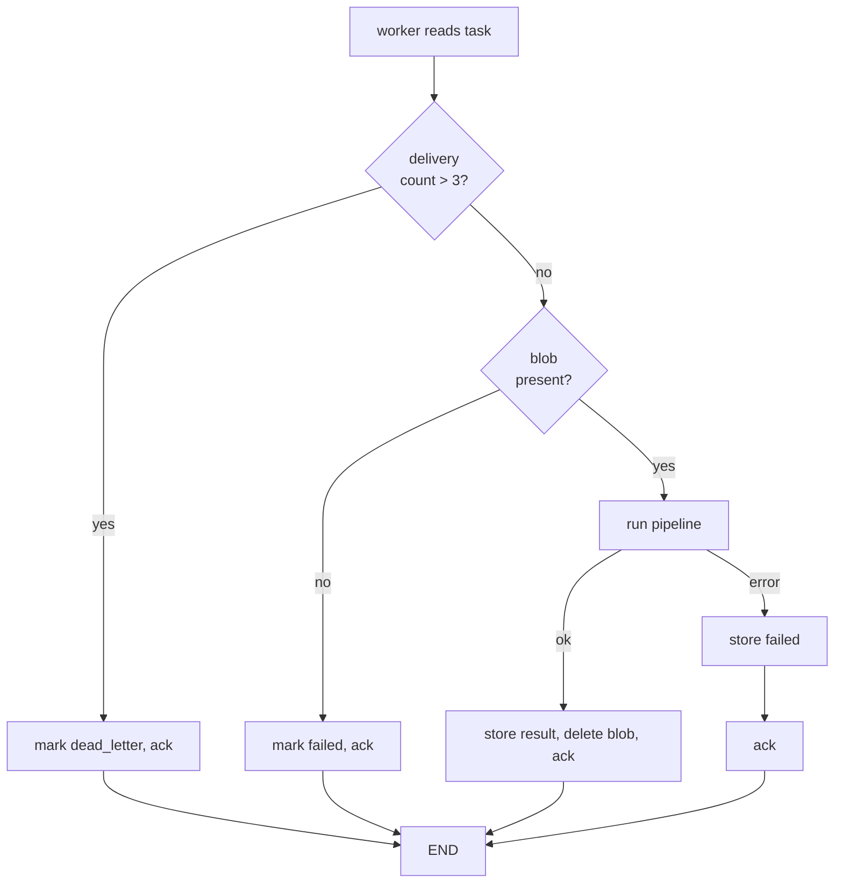
```mermaid
flowchart TD
    START[worker reads task] --> D{delivery<br/>count > 3?}
    D -- yes --> DL[mark dead_letter, ack] --> END
    D -- no --> B{blob<br/>present?}
    B -- no --> F[mark failed, ack] --> END
    B -- yes --> RUN[run pipeline]
    RUN -- ok --> OK[store result, delete blob, ack] --> END
    RUN -- error --> ERR[store failed] --> ACK[ack] --> END
```

---

## 13. High availability (surviving a Redis failure)

The baseline is one Redis Pod (simple; a restart loses in-flight runs). The HA
upgrade runs **three Redis nodes** (one master + two replicas) and **three
sentinels** that vote to promote a replica if the master dies.

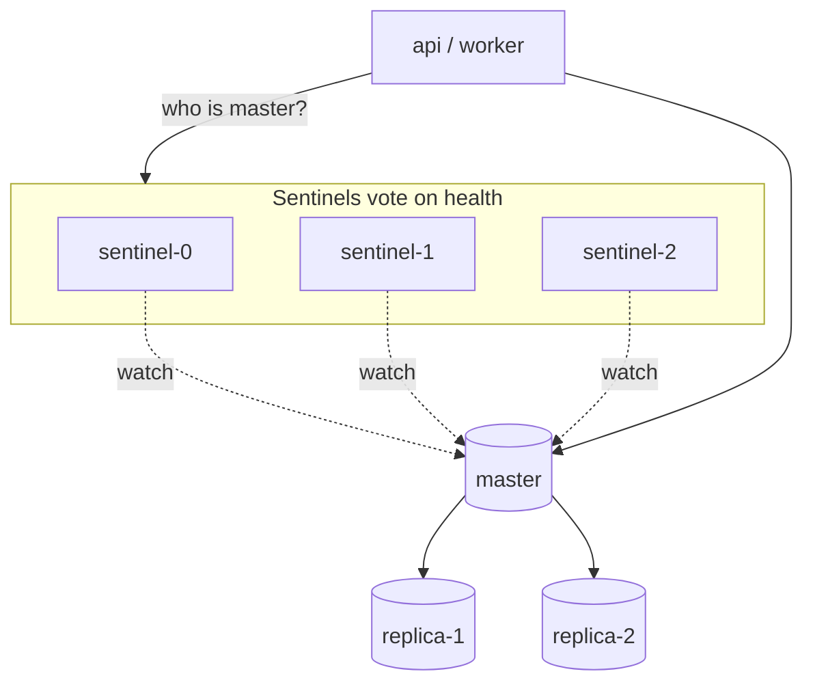
```mermaid
flowchart TB
    subgraph S[Sentinels vote on health]
      s0[sentinel-0]
      s1[sentinel-1]
      s2[sentinel-2]
    end
    M[(master)] --> R1[(replica-1)]
    M --> R2[(replica-2)]
    s0 & s1 & s2 -. watch .-> M
    app[api / worker] -->|"who is master?"| S
    app --> M
```

Failover, and why the app doesn't care:

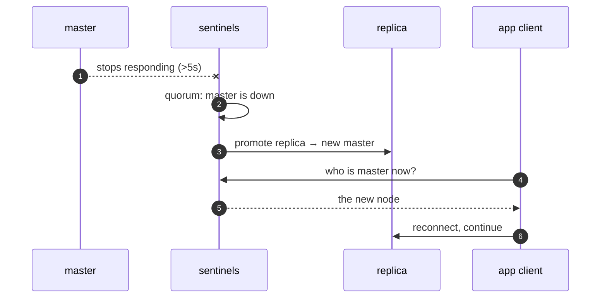
```mermaid
sequenceDiagram
    autonumber
    participant M as master
    participant S as sentinels
    participant R as replica
    participant A as app client
    M--xS: stops responding (>5s)
    S->>S: quorum: master is down
    S->>R: promote replica → new master
    A->>S: who is master now?
    S-->>A: the new node
    A->>R: reconnect, continue
```

The client is **Sentinel-aware**: it asks the sentinels for the current master on
each connection, so a promotion is invisible to triage. Data survives because the
nodes persist to disk (**AOF**) and replicate. Enable it with:

```bash
kubectl apply -k deploy/ha
```

See [Real-Time Triage §9](realtime-triage.md#9-high-availability-redis-sentinel)
for the exact env vars and manifests.

---

## 14. Security & isolation

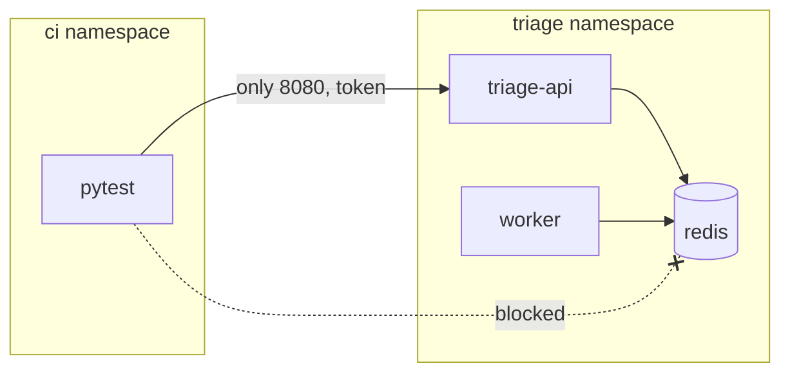
```mermaid
flowchart LR
    subgraph ci[ci namespace]
      PT[pytest]
    end
    subgraph tri[triage namespace]
      API[triage-api]
      R[(redis)]
      W[worker]
    end
    PT -->|only 8080, token| API
    API --> R
    W --> R
    PT -. blocked .-x R
```

- **Network policies** default-deny east-west traffic: the API is reachable only
  from the `ci` namespace; Redis only from the API and workers.
- The API can require a **bearer token**.
- Containers run **non-root**, read-only root filesystem, all Linux capabilities
  dropped.
- Nothing is exposed outside the cluster.

---

## 15. One image, three roles

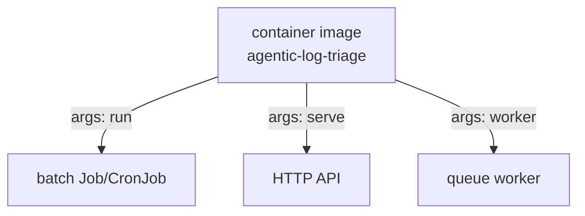
```mermaid
flowchart TD
    IMG["container image<br/>agentic-log-triage"]
    IMG -->|args: run| BATCH[batch Job/CronJob]
    IMG -->|args: serve| SERVE[HTTP API]
    IMG -->|args: worker| WORK[queue worker]
```

The same code ships once; Kubernetes chooses the role via `args`. This keeps build,
scan, and version management trivial.

---

## 16. Where to look in the code

| You want to understand… | Read this file |
| --- | --- |
| Data shapes (Failure, Incident, Task, RunState) | [`src/triage/schema.py`](https://github.com/karthikb35/agent-log-triage/blob/main/src/triage/schema.py) |
| Turning logs into failures | [`src/triage/ingest.py`](https://github.com/karthikb35/agent-log-triage/blob/main/src/triage/ingest.py) |
| The four agents | [`src/triage/agents/`](https://github.com/karthikb35/agent-log-triage/tree/main/src/triage/agents) |
| Wiring agents into a graph | [`src/triage/graph.py`](https://github.com/karthikb35/agent-log-triage/blob/main/src/triage/graph.py) |
| The HTTP API | [`src/triage/api.py`](https://github.com/karthikb35/agent-log-triage/blob/main/src/triage/api.py) |
| The queue (Redis Streams) | [`src/triage/queue.py`](https://github.com/karthikb35/agent-log-triage/blob/main/src/triage/queue.py) |
| The state/blob store | [`src/triage/store.py`](https://github.com/karthikb35/agent-log-triage/blob/main/src/triage/store.py) |
| The worker loop | [`src/triage/worker.py`](https://github.com/karthikb35/agent-log-triage/blob/main/src/triage/worker.py) |
| Idempotent ticket opening | [`src/triage/ticketing.py`](https://github.com/karthikb35/agent-log-triage/blob/main/src/triage/ticketing.py) |
| Redis client + Sentinel | [`src/triage/runtime.py`](https://github.com/karthikb35/agent-log-triage/blob/main/src/triage/runtime.py) |

---

## 17. Glossary of "why", in one place

- **Why deterministic agents?** Replayable, auditable, unit-testable.
- **Why a queue?** Decouple arrival from processing; absorb bursts.
- **Why Redis Streams (not Kafka)?** One component gives queue + state + blobs;
  modest scale; no external fan-out needed.
- **Why ack-last?** Guarantees no result is lost on a crash.
- **Why idempotency keys?** At-least-once delivery can retry; we must not double-act.
- **Why KEDA with a warm floor?** Scale with load, but no cold-start on the first
  request.
- **Why Sentinel?** Automatic failover so a Redis crash doesn't lose in-flight runs.
- **Why one image, three roles?** Simpler builds, scans, and versioning.

You now understand the whole system. Jump into
[Real-Time Triage](realtime-triage.md) for the production contract, or
[The Agents](agents.md) for the analysis internals.
