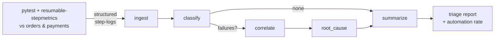

# Agentic Log Triage

> A **deterministic multi-agent** platform (LangGraph + MCP) that turns
> **high-volume structured test step-logs** into a short list of actionable
> incidents — and runs as a **Kubernetes Job**.

This is a runnable reference for the pattern behind the résumé line:

> *Designed and shipped a production-grade Agentic AI platform using LangGraph and MCP,
> including deterministic multi-agent workflows over high-volume structured logs;
> reduced operational triage effort by 50%.*

## The one-paragraph story

The [TicketHub microservices](https://github.com/karthikb35/kubernetes_full_microservices/tree/main/repo/services)
are exercised by a `pytest` suite instrumented with
[`pytest-resumable-stepmetrics`](https://pypi.org/project/pytest-resumable-stepmetrics/).
Every test emits a **structured JSON step-log** — named steps, per-attempt status,
resume-on-retry markers, and custom `service_calls` records. A **LangGraph** state
machine of four small, deterministic **agents** ingests those logs and, using
**MCP** tools, classifies each failure, correlates duplicates into incidents,
attaches a probable cause and runbook, and reports a **triage automation rate**.
The whole thing is packaged to run as a **CronJob/Job**.

## Why "deterministic"?

Because the graph topology is fixed, the agent nodes are pure functions, and the
tools are pure lookups, **the same logs always produce the same triage**. An LLM
can *narrate* the result (optional, behind a flag) but never *decides* anything.
That is what makes an "agentic" system safe to put in a CI gate.

## Where to go next

- **[Philosophy](philosophy.md)** — the design principles and why Jobs.
- **[Architecture](architecture.md)** — the pipeline, state, and data flow.
- **[The Agents](agents.md)** — what each node does.
- **[MCP Tools](mcp.md)** — the typed tool interface.
- **[Kubernetes Jobs](kubernetes-jobs.md)** — Jobs 101→advanced and the manifests.
- **[Testing & Step-Logs](testing.md)** — how the structured logs are produced.
- **[Quickstart](quickstart.md)** — run it in two minutes.
