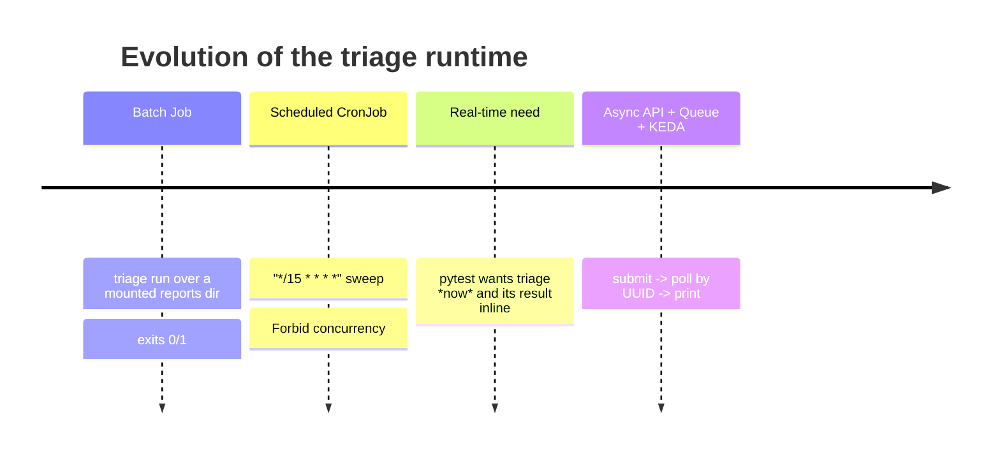
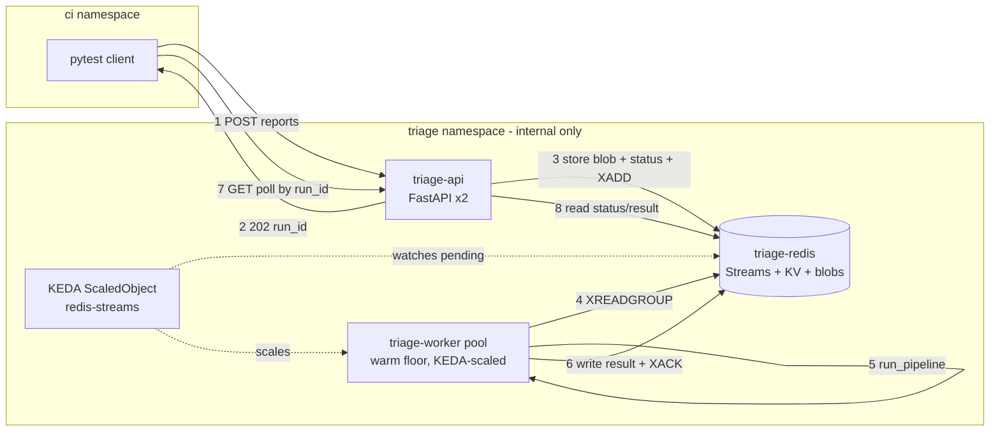
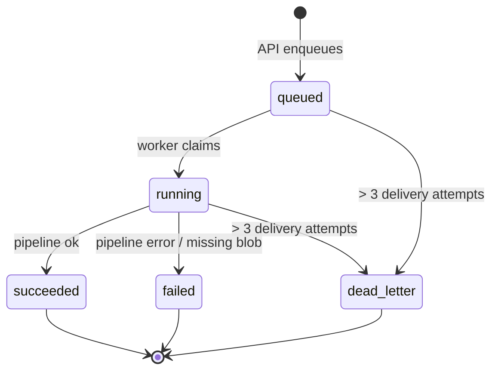
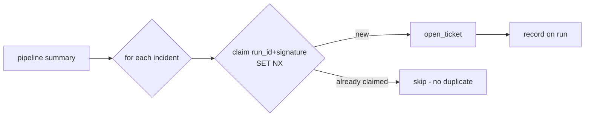
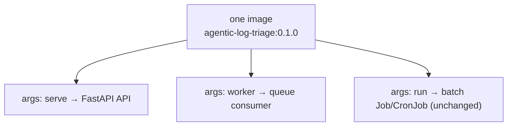
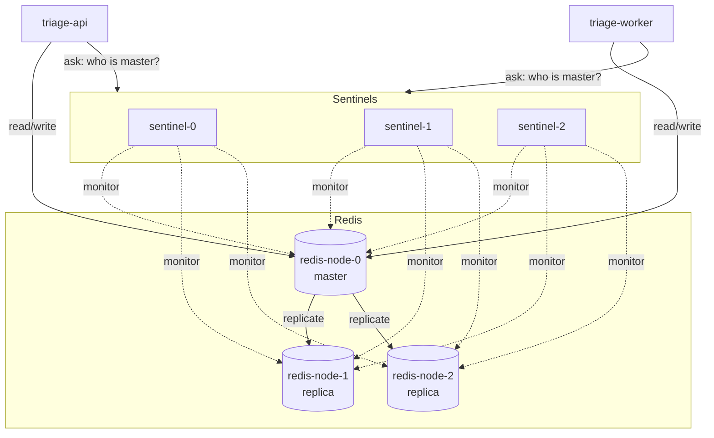
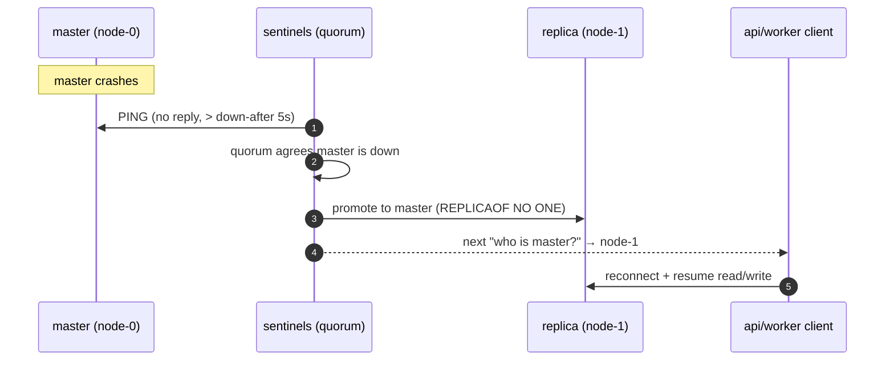

# Real-Time Triage: API + Queue + KEDA

This page documents the **event-driven** triage path that runs alongside the
original batch model. It keeps the full history: where we started, why we moved,
what we rejected, and how the flow works end to end.

!!! info "TL;DR"
    A pytest client `POST`s its step-logs to an internal **FastAPI** service, gets
    back a **run UUID**, and **polls** that UUID until triage finishes — then prints
    the result in its terminal. Behind the API, a **Redis Stream** buffers work and
    **KEDA** scales a warm pool of workers on backlog. No Kafka, no object storage.

---

## 1. History — how we got here

The platform began as pure **batch** work (see [Kubernetes Jobs](kubernetes-jobs.md)):



The batch spine is still correct for scheduled sweeps and backfills, and it stays
in the repo unchanged. What it could **not** do is give a pytest run an immediate,
per-run triage verdict it can print in its own terminal. That requirement is what
drove the new path.

---

## 2. Why we moved — and what we rejected

We evaluated three shapes against the real constraints (≤300 runs/min, 3× burst,
≤2 min latency, no external result consumers, no object storage, cold starts
unacceptable, 10–15 KB bundles, transient state only).

| Option | Verdict | Why |
| --- | --- | --- |
| **Kafka** + result topic | ❌ Rejected | No fan-out, no replay need, modest throughput — pure operational overhead |
| **K8s Job per run** | ❌ Rejected | 15 Jobs/sec abuses the scheduler; per-run pod cold start violates the hard constraint |
| **Postgres queue** | ➖ Viable | Fine, but we don't need durability/audit; adds a second datastore |
| **Redis Streams + KEDA** | ✅ Chosen | Queue **and** state **and** blob store in one component; native KEDA scaler; TTL self-cleaning |

!!! quote "The decision in one line"
    *Redis Streams collapses the queue, the run-state store, and the report-blob
    store into a single stateful component that KEDA already knows how to scale —
    the least machinery that satisfies every constraint.*

### Why not LangServe?

LangServe wraps a LangGraph app in **synchronous** invoke/stream endpoints on top
of FastAPI. Our primary operation is *"accept work, return a ticket, poll later"* —
an asynchronous command, not a graph invocation. So the production path is plain
FastAPI + a queue. LangServe remains a fine *optional* addition later for an
internal `/graph/invoke` debug endpoint.

---

## 3. The architecture



**Component roles**

| Component | Role | Manifest |
| --- | --- | --- |
| `triage-api` | Validate, enqueue, serve polls. Never runs the pipeline. | [`deploy/api-deployment.yaml`](https://github.com/karthikb35/agent-log-triage/blob/main/deploy/api-deployment.yaml) |
| `triage-redis` | Stream queue + run-state + report blobs, all TTL'd. | [`deploy/redis.yaml`](https://github.com/karthikb35/agent-log-triage/blob/main/deploy/redis.yaml) |
| `triage-worker` | Consume tasks, run the LangGraph pipeline, persist result. | [`deploy/worker-deployment.yaml`](https://github.com/karthikb35/agent-log-triage/blob/main/deploy/worker-deployment.yaml) |
| KEDA `ScaledObject` | Scale workers on stream backlog; keep a warm floor. | [`deploy/keda-scaledobject.yaml`](https://github.com/karthikb35/agent-log-triage/blob/main/deploy/keda-scaledobject.yaml) |
| `NetworkPolicy` | API reachable from CI only; Redis from API/worker only. | [`deploy/networkpolicy.yaml`](https://github.com/karthikb35/agent-log-triage/blob/main/deploy/networkpolicy.yaml) |

---

## 4. The request/response flow

```mermaid
sequenceDiagram
    autonumber
    participant PT as pytest client
    participant API as triage-api
    participant R as Redis
    participant W as worker

    PT->>API: POST /v1/triage/runs { reports, fail_under }
    API->>R: SET reports blob + run(queued) + XADD task
    API-->>PT: 202 { run_id, poll_url }
    loop until terminal (≤ 2 min budget)
        PT->>API: GET /v1/triage/runs/{run_id}
        API->>R: GET run state
        API-->>PT: { status: queued|running|succeeded|failed }
    end
    W->>R: XREADGROUP (claim task)
    W->>R: GET reports blob
    W->>W: run_pipeline (classify→correlate→root_cause→summarize)
    W->>R: SET run(succeeded, summary) ; DEL blob
    W->>R: XACK (last!)
    PT->>API: GET /v1/triage/runs/{run_id}/result
    API-->>PT: { summary } → printed in terminal
```

### The API contract

```text
POST /v1/triage/runs             -> 202 { run_id, poll_url }   (Idempotency-Key honored)
GET  /v1/triage/runs/{run_id}    -> { run_id, status, attempts, error? }
GET  /v1/triage/runs/{id}/result -> { run_id, summary }        (409 until terminal, 404 if unknown/expired)
GET  /healthz  /readyz
```

### Printing the result in the pytest terminal

```python
import time, requests

r = requests.post(f"{TRIAGE_API}/v1/triage/runs",
                  json={"reports": reports, "fail_under": 0.5}, timeout=30)
r.raise_for_status()
run_id = r.json()["run_id"]

for delay in (1, 2, 4, 8, 10, 10, 10):
    s = requests.get(f"{TRIAGE_API}/v1/triage/runs/{run_id}", timeout=30).json()
    if s["status"] in {"succeeded", "failed", "dead_letter"}:
        break
    print(f"triage {s['status']} ({run_id})")
    time.sleep(delay)

res = requests.get(f"{TRIAGE_API}/v1/triage/runs/{run_id}/result", timeout=30).json()
summary = res["summary"]
print(f"automation rate: {summary['automation_rate']:.0%}  incidents: {summary['total_incidents']}")
```

---

## 5. Run lifecycle & failure handling



The correctness core is **at-least-once with ack-last**:

- The worker **persists the result, then `XACK`s**. A crash before ack redelivers
  the task; the pipeline is deterministic and the store **upserts on `run_id`**, so
  reprocessing reproduces the identical result — safe by construction.
- A worker that dies mid-run leaves the task in the pending list; a healthy worker
  **`XAUTOCLAIM`s** it after a 60 s idle timeout.
- A **poison message** (repeatedly crashes) is parked as `dead_letter` after 3
  deliveries so a polling client always reaches a terminal state.
- **Idempotent submits**: an `Idempotency-Key` header collapses duplicate posts
  onto the same `run_id` via Redis `SET NX`.
- **Back-pressure**: the API returns `429` once stream backlog exceeds
  `TRIAGE_MAX_PENDING`, so clients retry instead of overwhelming Redis.

---

## 6. Scaling & sizing

| Dimension | Value | Rationale |
| --- | --- | --- |
| Sustained load | 300 runs/min (5/s) | ~3 workers at ~0.5 s/run |
| Peak burst | 900 runs/min (15/s) | ~8 workers; headroom to 20 |
| Worker floor | `minReplicas: 4` | cold starts unacceptable → never scale to zero |
| Worker ceiling | `maxReplicas: 20` | absorbs the 3× burst within the 2 min budget |
| Redis memory | 1 GiB, `noeviction` | worst case ~30 MB working set (1,800 × 15 KB) |
| KEDA trigger | `pendingEntriesCount: 30` | scale up when per-replica backlog builds |

!!! warning "Single Redis is the *baseline*, not the only option"
    The default [`deploy/redis.yaml`](https://github.com/karthikb35/agent-log-triage/blob/main/deploy/redis.yaml)
    is a single instance: a restart drops in-flight runs and clients resubmit.
    That is fine for the transient state we keep (≤5 min). When losing in-flight
    runs on a restart is *not* acceptable, switch to the **Redis Sentinel** HA
    topology — see [§9](#9-high-availability-redis-sentinel) below.

---

## 7. Side effects: idempotent ticket opening

Ticket opening is the one deliberate side effect, and it lives in the **worker,
after** a successful pipeline run — never inside the deterministic graph, which
stays pure and replayable. One incident yields at most one ticket (the same
de-duplication the correlator applies to failures, carried into the tracker).



Correctness under at-least-once delivery comes from a per-run dedupe key
(`run_id + service + category + signature`) claimed via Redis `SET NX`: a
redelivered task finds the key set and skips, so a ticket is never opened twice.

It is **off by default** and dry-run even when on, so triage stays read-only until
you opt in:

| Env var | Default | Effect |
| --- | --- | --- |
| `TRIAGE_OPEN_TICKETS` | `0` | `1` enables ticket opening in the worker |
| `TRIAGE_TICKETS_DRY_RUN` | `1` | `0` performs real ticket creation |

When enabled, the opened tickets are attached to the run under
`summary.tickets`, so a polling client sees exactly what was filed.

---

## 8. What runs where



One image, three roles selected by `args`. The batch `run` path — and the Job /
CronJob manifests behind it — are untouched by this work.

---

## 9. High availability (Redis Sentinel)

The baseline runs one Redis Pod. To survive a Redis failure **without losing
in-flight runs**, switch to a Sentinel topology: multiple Redis nodes (one master,
several replicas) watched by multiple **Sentinel** processes that elect a new
master automatically.



**How a failover plays out**



The application side is already **Sentinel-aware**: set `TRIAGE_REDIS_SENTINELS`
and the client
([runtime.py](https://github.com/karthikb35/agent-log-triage/blob/main/src/triage/runtime.py))
asks the sentinels for the current master on every connection, so a promotion is
transparent — the queue, run-state, and report blobs (AOF-persisted on the nodes)
survive the failover.

| Env var | Example | Meaning |
| --- | --- | --- |
| `TRIAGE_REDIS_SENTINELS` | `triage-sentinel:26379` | Comma-separated `host:port` sentinels; enables HA mode |
| `TRIAGE_REDIS_MASTER_NAME` | `triage` | The monitored master's name |
| `TRIAGE_REDIS_PASSWORD` | *(secret)* | Optional auth for nodes + sentinels |

Deploy it with the overlay — it swaps the single instance for the Sentinel stack
and injects the env above:

```bash
kubectl apply -k deploy/ha
```

Manifests: [`deploy/redis-ha.yaml`](https://github.com/karthikb35/agent-log-triage/blob/main/deploy/redis-ha.yaml)
(nodes + sentinels + network policies) and
[`deploy/ha/kustomization.yaml`](https://github.com/karthikb35/agent-log-triage/blob/main/deploy/ha/kustomization.yaml)
(the overlay). For very large or regulated environments, a managed Redis or a
Redis operator remains the lower-operational-risk choice; this topology is a
correct, self-contained reference.
